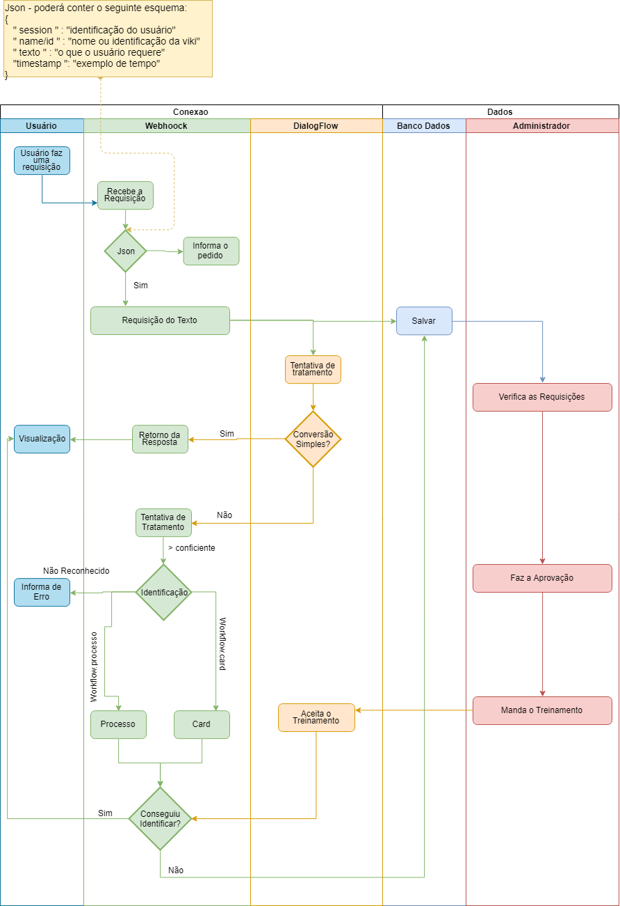

# DialogFlowViki

Implementação para comunicação com a api do `DialogFlow` em __python__. Para isso acontecer precisa de 2 etapas, fazer a configuração com a chave de autenticação.

Antes você começar programar é melhor ensinar como funciona a API `dialogflow`. Diferente de todos os tutoriais vou explicar sucintamente:

### @Teoria

O que você vai precisar entender, que para cada frase no dia a dia temos: {`inteção`, `palavras chaves`, `resposta` e `contexto`}

#### O que é cada coisa?
  * `Inteção` - a intenção do usuário - *o que ele quis*
    * para cada inteção temos:
      * `Contexts` - contexto que o usuário falou aquilo, normalmente é o que __vem__ de outras frases
      * `Events` - de onde que aquela frase veio
      * `Training phrases` - frases de treinamento
      * `Action and parameters` - ação e palavras chaves
      * `Responses` - respostas
      * `Fulfillment` - ele vai ter tratamento de API
  * `Entidade` - as palavras chaves da frases

Para cada intenção pode ter um `Fulfillment` diferente;


#### "Tá eu ainda não entendi, dá um exemplo?"

Vamos pensar na frase

```
quero tomar um café
```

* __Inteção__: usuário quer tomar café - {__user.wanna.drink__}
  * `Contexts` - vem de outra frase o que o usuário falou?
  * `Events` - evento: {**tomar algo**}
  * `Action and parameters`: associado com a parte de Entidades
    ```

    quero tomar            um              café
                      {@quantidade}       {@hot_drink}

    ```
  * `Response` - aqui você cadastra uma resposta para esse exemplo frase ou dá continuidade na conversa:
    ```

      Resposta Simples - Vou redirecionar para o café

      ou

      Resposta com continuidade - Que tipo de café você gostaria?
    ```
* __Entidade__:
  * `@hot_drink` - ligado com {**café**}
  * `@quantitade` - ligado com {**um**}

#### @Chave de autenticação

Para você conseguir trabalhar com a aplicação você deverá fazer o seguinte tutorial:

```
https://cloud.google.com/docs/authentication/getting-started
```

O tutorial à principio é fácil de entender, porém toma uma certa complexidade. Em resumo da ópera, para simplificar as coisas você tem que gerar __uma chave da aplicação__.

Com o seguinte formato:

```json
{
  "type": "service_account",
  "project_id": "nome-talk-1",
  "private_key_id": "private_id",
  "private_key": "private_key",
  "client_email": "adminmaster@project_id.iam.gserviceaccount.com",
  "client_id": "client_id",
  "auth_uri": "https://accounts.google.com/o/oauth2/auth",
  "token_uri": "https://oauth2.googleapis.com/token",
  "auth_provider_x509_cert_url": "https://www.googleapis.com/oauth2/v1/certs",
  "client_x509_cert_url": ""
}
```

Os nomes foram alterados, mas você precisará que seja uma adminmaster ou seja, um administrador da aplicação.

Depois dessa configuração você precisará configurar a chave como uma **variável de ambiente** com o seguinte nome: {`GOOGLE_APPLICATION_CREDENTIALS`}. Depois conseguirá rodar o código.

#### @Código

Esta parte representa a seguinte estrutura de projeto `mvc`

```
|-- app/
  | -- errors/
    | -- handler.py - trata dos erros da página do administrador
  | -- main/
    | -- form.py - formulário de login
    | -- routes.py - rotas para o administrador conseguir validar.
    | -- util.py - funções que serão necessárias para a aplicação
  | -- models/
    | -- models_sql_alchemy.py - models da aplicação
  | -- static/
    | -- img/ - imagens
    | -- js/ - javascript
    | -- main.css - o único arquivo css da aplicação
  | -- templates/
    | -- errors/
      | -- 403.html
      | -- 404.html
      | -- 500.html
    | -- home.html - one page do administrador
    | -- layout.html - layout da aplicação
    | -- login.html - página de login
  | -- __init__.py
  | -- config.py - para configuração da aplicação (chave, url do banco)
  | -- manipulation_base.py - funcoes para manipular o banco
  | -- site.db -- banco de dados, em formato sqllite3
|-- run.py -- onde vai acontecer o arquivo para rodar o projeto
```


### Precisa?

Para esse projeto funcionar você deve instalar as seguintes dependências:

```
  * Flask
  * Flask-Login
  * Flask-SQLAlchemy
  * Flask-WTF
  * SQLAlchemy
  * SpeechRecognition
  * dialogflow
  * docutils
  * google-api-core
  * google-auth
  * google-cloud
  * google-cloud-core
  * google-cloud-storage
  * secrets2env
  * setuptools
```

__DICA__:> Se você usar uma IDE, acredito que ele já consegui baixar sozinho.


### @Arquitetura:

para você não ficar perdido e entender o que realmente entender o funcionamento etapa por etapa:


